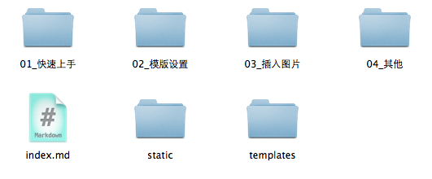

# Welcome to Markup

## 功能介绍
 

markup 是一个dropbox+markdown的文档生成器。它有两个比较有意思的点：

* 通过dropbox来发布，你可以将你的dropbox的一个文件夹设置成发布文件夹。你想发布什么文档直接放到文件夹里就OK了，Dropbox同步后会自动生成对应的文档网页。

* 采用markdown的方式来编辑文档。markdown是一种机器方便的编写文档的东西，极大的提高写作效率。

## 例如本站就是在自己的电脑上用这个目录建立的
